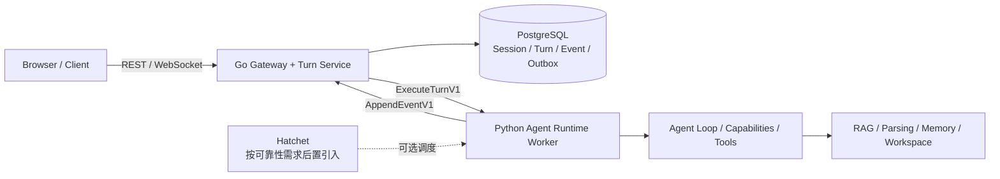

# DeepTutor Go 目标架构可实施性评估

> 评估对象：`docs/golang-req/golang-arch.md`  
> 评估基线：`feat/run_v5`，commit `4eddf70c888584314ac042a4032ab40bbf774971`，DeepTutor `1.5.2`  
> 评估日期：2026-07-22  
> 评估方法：当前代码核验 + Hatchet 官方资料校准 + `gclaude` / `dclaude` 外部路由调用

## 1. 结论

### 1.1 决策建议

**方案方向条件通过，但不建议按原图直接开工。**

原方案提出的“Go Control Plane + Python Agent Runtime”边界是可行的；把整个“上层应用”一次性改写为 Go 则不可行，也没有必要。当前文档更接近一份目标架构草图，还缺少可执行的跨语言契约、数据所有权、幂等语义、灰度/回滚方案和本地模式兼容设计。

综合评级：

| 评估项 | 评级 | 结论 |
| --- | --- | --- |
| Go Control Plane 方向 | 7/10，中高可行 | 适合承接接入、Turn/Session/Event、连接管理和确定性控制逻辑 |
| “上层应用全部 Go 化” | 3/10，低可行 | 上层业务大量直接依赖 Python Agent Loop、Prompt、Tool、RAG 和文件上下文 |
| 原文作为实施方案的完整度 | 4/10 | 有目标拓扑，没有足够的契约、迁移和验收定义 |
| Strangler 渐进迁移 | 8/10，高可行 | 可以先代理、再接管状态、最后按价值引入 durable workflow |
| Big-bang 重写 | 2/10，高风险 | 会同时改变语言、存储、调度、消息系统和部署模型，难以回归 |

建议采用以下目标边界：



关键原则：

1. Go 先成为控制面，不重写 Python AI 执行核。
2. PostgreSQL Event Store 是客户端回放的事实源；Hatchet 的 workflow state 不能替代产品事件表。
3. Hatchet 与 Redis/NATS 不应同时作为第一阶段必选项。
4. 保留当前 Python + SQLite/PocketBase 的 local-first 模式；分布式 server mode 作为另一种部署形态。
5. 迁移前先把当前隐式 Python 对象边界变成严格、版本化、可跨语言传输的契约。

## 2. 对原方案现状描述的核验

### 2.1 准确的判断

原文以下判断与当前代码一致：

| 判断 | 当前代码证据 |
| --- | --- |
| 主链路围绕 `UnifiedContext -> ChatOrchestrator -> Capability` | `deeptutor/core/context.py:33-84`；`deeptutor/runtime/orchestrator.py:26-94` |
| Tool 与 Capability 是两级扩展面 | `deeptutor/core/tool_protocol.py:47-153`；`deeptutor/core/capability_protocol.py:20-68` |
| `TurnRuntimeManager` 承担了过多职责 | `deeptutor/services/session/turn_runtime.py:607-836`、`1155-1840`，单文件约 2,042 行 |
| Turn 执行与 ask-user 等待仍是进程内状态 | `turn_runtime.py:615-626`、`1191-1199` |
| 重启后没有真正的执行恢复 | `turn_runtime.py:647-666` 会把没有本地 execution 的 running Turn 标为 failed |
| RAG provider 抽象存在执行语义泄漏 | `deeptutor/services/rag/service.py:23-120`；PageIndex 特判见 `deeptutor/agents/chat/agentic_pipeline.py:445-516` |
| Capability 插件缺少版本/兼容/权限契约 | `deeptutor/core/capability_protocol.py:20-30` 的 Manifest 没有 API version；动态加载见 `runtime/registry/capability_registry.py:21-78` |
| Python RAG/解析依赖很重 | `pyproject.toml:39-53`、`147-204` 包含 LlamaIndex、FAISS、Docling、MarkItDown、PyMuPDF4LLM、GraphRAG、RAG-Anything 等 |

### 2.2 必须修正或限定的描述

#### A. “流式事件同时保存在 Session Store”不准确

原文 `golang-arch.md:201` 写道事件会被编号并同时保存到 Turn Runtime 和 Session Store。当前真实流程是：

1. `_publish_live_event()` 分配 `seq`，写入 `execution.events` 内存缓冲并投递实时订阅者：`turn_runtime.py:1841-1870`；
2. Turn 完成、取消或异常后，才调用 `_flush_buffered_events()`：`turn_runtime.py:1721-1729`、`1765`、`1801`、`1824`；
3. `_flush_buffered_events()` 再逐条写 Store：`turn_runtime.py:1987-2009`。

因此，当前具备的是“终态后可回放”，不是严格的 write-ahead streaming persistence。进程硬崩溃时，尚未 flush 的本轮事件可能丢失。

PocketBase 路径更加明确地采用终态批量落库：`pocketbase_store.py:551-638`。这也意味着“重启安全”需要区分：历史/终态回放相对安全，正在执行的 Turn 和未 flush 事件不安全。

#### B. “可恢复、可重放”只适用于连接和已持久事件

`subscribe_turn(after_seq)` 会先读 Store，再拼接当前进程 live queue：`turn_runtime.py:995-1092`。但如果当前进程已经没有 execution，running Turn 会被标为失败，而不是从执行点继续：`turn_runtime.py:647-666`。

所以原文的“恢复”应改成：

- 支持 WebSocket 断线后的已持久事件 replay；
- 不支持 Python 进程重启后的 Agent execution continuation；
- ask-user 期间的 `asyncio.Queue` 也不会跨进程恢复。

#### C. `UnifiedContext` 还不是跨服务 DTO

`UnifiedContext` 使用 `dict[str, Any]` 作为 `metadata`：`deeptutor/core/context.py:67-84`。Turn Runtime 还把 `_wait_for_user_reply` Python callable 放进 metadata：`turn_runtime.py:1613-1658`。WebSocket 发送端通过 `json.dumps(..., default=str)` 容忍不可序列化值：`deeptutor/api/routers/unified_ws.py:57-65`。

这在单进程 Python 中可用，但不能直接作为 Go/Python RPC 合同。跨语言前必须把 callback、ContextVar、Path 对象和任意 metadata 替换成显式 ID、枚举和 typed payload。

#### D. “所有功能共享同一运行时”是主路径结论，不是全仓事实

统一 `/api/v1/ws` 是核心入口，但当前仍有多个独立 WebSocket：

- legacy chat：`deeptutor/api/routers/chat.py:59`
- book：`deeptutor/api/routers/book.py:490`
- question：`deeptutor/api/routers/question.py:43,353`
- quiz judge：`deeptutor/api/routers/quiz_judge.py:196`
- partner：`deeptutor/api/routers/partners.py:994`
- knowledge progress：`deeptutor/api/routers/knowledge.py:2525`

此外，cron、plugin API 和 partner runtime 仍可直接构建 `ChatOrchestrator`。因此 Go Gateway 的兼容范围不能只看 `/api/v1/ws`，必须明确哪些入口透明代理、哪些入口迁移、哪些保留 Python。

#### E. `StreamEvent` 有良好雏形，但不是生产级跨语言事件协议

当前事件有 `type/source/stage/content/metadata/session_id/turn_id/seq/timestamp`：`deeptutor/core/stream.py:17-72`，但还缺少：

- `schema_version`；
- 全局唯一 `event_id`；
- producer/attempt；
- typed metadata union；
- 幂等冲突规则；
- payload 大小和 artifact 引用规则；
- 明确的 timestamp/ordering 保证。

SQLite 使用 `UNIQUE(turn_id, seq)`，但写入是 `INSERT OR REPLACE`：`sqlite_store.py:177-192`、`657-700`。同一 `seq` 的不同内容会被替换，不足以检测生产者分叉。

## 3. 可实施的 Go/Python 边界

| 模块/职责 | 建议所有者 | 可行性 | 原因与前置条件 |
| --- | --- | --- | --- |
| API Gateway、连接管理、限流、健康检查 | Go | 高 | 与 AI 生态无关；可先透明代理，风险最小 |
| `/api/v1/ws` Turn 命令状态机 | Go | 高 | 消息类型清晰，但需先冻结 wire contract |
| Session/Turn/Event 持久化和回放 | Go + PostgreSQL | 高 | `SessionStoreProtocol` 已提供接口雏形：`session/protocol.py:13-82` |
| Event `seq` 分配、幂等、Outbox | Go Event Service | 高 | 必须只有一个权威 seq owner，不能 Go/Python 双方各自编号 |
| Auth token 校验、tenant claim | Go，渐进迁移 | 中 | 当前授权依赖 Python `ContextVar`：`multi_user/context.py:11-45`；先透传，再提取显式 claim |
| 最终 Context Assembly | Python | 高（保留） | 当前包含附件解析、Notebook LLM 分析、Book、Memory、Skills、Persona 和 callable；过早迁移等于重写业务 |
| 资源引用解析/权限过滤 | 共享契约，后续可 Go | 中 | 先把 path 改为 tenant/workspace/resource ID，再决定实现位置 |
| ChatOrchestrator、Agent Loop | Python | 高（保留） | 当前核心执行链和 Provider 适配均是 Python |
| Capability/Tool Registry | Python | 高（保留） | 动态 import、插件、Tool kwargs 与当前 Agent Loop 强耦合 |
| RAG、文档解析、Embedding | Python service | 高（保留） | Python 生态绑定强；`RAGService` 已是可进一步服务化的 facade |
| Memory consolidation 与证据链 | Python service | 中高（保留） | 文件工作区和 LLM consolidation 仍是 Python 语义 |
| Workspace/Artifact 存储 | Storage Adapter | 中 | 当前 `PathService` 以本地路径为所有权边界：`path_service.py:80-130`、`186-231` |
| Learning grading/mastery/scheduler | 后续可 Go | 中高 | 算法相对确定性，见 `learning/grading.py`、`mastery.py`、`scheduler.py`；不是第一迁移优先级 |
| CLI 与 Python SDK | Python | 高（保留） | `deeptutor app` facade 直接运行本地 runtime；强行依赖 Go 服务会破坏 CLI-only/local-first |
| Partner channels | Python | 中高（保留） | 大量 Python channel SDK、workspace 和现有 agent loop 复用 |

结论不是“Python 留基础层、Go 写上层应用”，而是：

> **Go 承接可靠控制面；Python 继续拥有 AI 执行面与当前产品语义。**

## 4. Hatchet、PostgreSQL、Redis/NATS 的判断

### 4.1 PostgreSQL：server mode 采用，但不是 local mode 的强制依赖

建议：**采用，但放在 Go Turn/Event Service 接管状态的阶段。**

理由：

- 当前 SQLite/PocketBase 都能实现 `SessionStoreProtocol`，说明存在可替换 seam；
- 多副本下需要数据库级唯一约束、事务、并发控制和 outbox；
- 但 `pip install deeptutor`、CLI-only 和单机 Docker 的低运维成本是现有产品能力，不能被 PostgreSQL 强制替代。

建议形成两个 profile：

- `local`：Python + SQLite（PocketBase 可选）；
- `distributed`：Go + PostgreSQL + Python workers，Hatchet 可选。

### 4.2 Hatchet：能力匹配，但应后置到 durability pilot

建议：**defer，不作为 Phase 0/1 前置依赖。**

Hatchet 官方资料确认它支持：

- PostgreSQL 作为 workflow state 的事实源，并采用 at-least-once 执行；worker 必须幂等：[Architecture & Guarantees](https://docs.hatchet.run/v1/architecture-and-guarantees)；
- durable event wait，可用于 human-in-the-loop：[Durable Event Waits](https://docs.hatchet.run/v1/durable-event-waits)；
- worker 向消费者流式输出：[Streaming](https://docs.hatchet.run/v1/streaming)。

但它不会自动把当前 2,000 多行 `_run_turn()` 变成“从任意 LLM/tool 轮次继续”的 durable execution。若只把整个 coroutine 包装成一个 Hatchet task，失败后的语义是至少一次重跑整个 task；当前的消息写入、Memory trace、外部工具、代码执行、文件写入和模型计费都还没有统一幂等键。

因此在启用自动 retry 前，至少需要：

1. 显式保存 Agent conversation/checkpoint；
2. 每个 LLM round 和 tool call 有稳定 `operation_id`；
3. 外部副作用工具支持幂等或明确标记不可重试；
4. 区分 workflow retry 与用户 regenerate；
5. 把 ask-user continuation 从 Python callable/queue 变成 durable signal + persisted continuation state。

### 4.3 Redis/NATS：第一阶段不引入

建议：**avoid now，达到明确吞吐/跨区域门槛后再选一个。**

原图同时画出 Hatchet、PostgreSQL Event Store 和 Redis/NATS，职责存在重叠。Hatchet 官方架构说明 PostgreSQL-only 可以工作，高吞吐自托管再按需增加 RabbitMQ，而不是必须另带 Redis/NATS。

更重要的是，Hatchet 官方 streaming 文档明确提示：订阅建立前发布的 stream event 可能被丢弃。因此 Hatchet stream 不能替代 DeepTutor 的持久化 replay。正确关系应是：

1. 产品事件先提交到 PostgreSQL Event Store；
2. Outbox/notification 唤醒 Go WebSocket fan-out；
3. 客户端始终以 `after_seq` 从 Event Store 补齐；
4. broker 只负责通知，不是事实源。

初期可使用 PostgreSQL + outbox/polling/notification；只有压测证明数据库通知或单区 fan-out 不够时，再在 NATS JetStream、Redis Streams 或 Hatchet 自托管推荐的 RabbitMQ 中选择一个，避免三套消息基础设施并存。

## 5. 必须先冻结的跨语言契约

### 5.1 `ExecuteTurnRequestV1`

必须显式包含：

- `schema_version`
- `request_id` / `idempotency_key`
- `tenant_id`、`user_id`、`workspace_id`
- `session_id`、`turn_id`
- capability 与版本
- model selection 的稳定 ID，不传密钥
- tools/KB/skills/persona/attachments 的 opaque resource refs
- branch parent、regenerate/supersede 关系
- language/config 与大小限制

不得包含 Python callable、文件系统对象、ContextVar 或任意不可序列化对象。

### 5.2 `StreamEventV1`

建议最小字段：

```text
schema_version
event_id
tenant_id / session_id / turn_id
attempt
seq                 # 由 Event Store 原子分配
type / source / stage
content
metadata            # 按 type 定义 typed schema
artifact_refs
occurred_at / committed_at
```

写入规则：

- `(turn_id, seq)` 唯一；
- `event_id` 全局唯一；
- 重复 `event_id` + 相同 payload 为幂等成功；
- 重复 key + 不同 payload 必须报冲突，不允许 `REPLACE`；
- 先 commit，再 fan-out；
- `done` 只能在 assistant message/result 与终态一致后生成。

### 5.3 `HumanInputSignalV1`

至少包含：

- `turn_id`
- `wait_id`，对应哪一次 ask-user/tool call
- `reply_id`，用于幂等
- typed answers
- user/tenant claims
- submitted_at

当前仅用 `turn_id -> asyncio.Queue`，无法区分重试后多个 waiter，也不能安全处理重复提交。

### 5.4 状态机

建议明确状态：

```text
accepted -> queued -> running -> waiting_input -> running
                                -> cancelling -> cancelled
                                -> completed
                                -> failed
```

当前 `running` 同时表示真正运行和等待用户输入；分布式控制面需要把二者拆开，否则超时、告警、并发和 worker slot 都无法准确管理。

## 6. 推荐迁移路线

### Phase 0：契约和正确性基线

目标：不引入 Go/Hatchet，先让现有 Python runtime 具备可外置的边界。

交付物：

- versioned JSON Schema / OpenAPI / AsyncAPI（或 protobuf）合同；
- Python/TypeScript golden fixtures；
- 严格 JSON 序列化，移除 transport 层 `default=str` 的兜底；
- event append-before-publish 或明确的 WAL/chunk commit 语义；
- Turn 状态机、幂等键、错误码和 payload 限制；
- `tenant_id/user_id/workspace_id` 显式化；
- 明确 SLO：是否要求进程重启继续、允许丢多少 token event、最大 Turn 时长、并发和 DAU。

退出条件：

- 现有 Web、CLI、SDK 使用同一组 golden contract；
- crash 后已确认提交的 event 不丢、不乱序；
- 任意 metadata 都能通过 strict schema；
- ask-user、cancel、regenerate、branch 有状态转换测试。

### Phase 1：Go Edge Proxy（不接管业务状态）

目标：先验证 Go 接入层和协议兼容，不同时迁移数据库。

交付物：

- Go Gateway 透明代理现有 REST 和 WebSocket；
- 认证 claim 透传、trace ID、限流和 metrics；
- `/api/v1/ws` 全消息类型 parity；
- 其他独立 WebSocket 继续透明代理到 Python。

退出条件：

- 前端零改动；
- `start_turn/subscribe/resume/cancel/submit_user_reply/regenerate/check_active_turn` 行为一致；
- 可按 tenant/capability feature flag 回退为直连 Python。

### Phase 2：Go Turn/Event Service + PostgreSQL

目标：Go 成为 Session/Turn/Event 的唯一权威控制面，Python 仍完整执行 AI Turn。

交付物：

- PostgreSQL session/turn/message/event/outbox schema；
- Go `StartTurn/AppendEvent/Subscribe/Cancel/SubmitReply`；
- Python `ExecuteTurnV1` worker adapter；
- event append 后 fan-out；
- SQLite/PocketBase 数据导入工具与 per-tenant cutover flag；
- shadow read/compare，不做长期双主双写。

退出条件：

- kill -9 Python worker 后，所有已提交 event 可回放，Turn 状态可解释；
- Go/Python 并发写不会产生重复 seq；
- message branch、regenerate、assistant trace 与现有行为一致；
- local profile 不依赖 Go/PostgreSQL。

### Phase 3：Durable Execution Pilot

目标：只对一个低副作用场景验证 Hatchet，而不是一次接管所有 capability。

建议顺序：

1. tools-disabled plain chat；
2. 多 LLM round、只读 tools；
3. cancellation；
4. ask-user durable event wait；
5. 可写 tools 与 artifacts；
6. deep research/solve 等长流程。

交付物：

- workflow/run ID 与 DeepTutor turn/attempt 映射；
- checkpoint schema；
- tool/LLM operation id；
- retry policy 和不可重试错误分类；
- 模型计费、外部 API、文件写入的幂等验证。

退出条件：

- 在 LLM 前、LLM 后、tool 前、tool 后、wait 前、wait 后注入崩溃，结果无重复副作用；
- ask-user 在 worker 重启后仍能匹配同一 `wait_id`；
- retry 与 regenerate 在事件和 UI 上可区分。

### Phase 4：按价值迁移确定性服务

可选候选：

- Learning grading/mastery/scheduler；
- cron/job control；
- tenant/resource grants；
- artifact metadata 与 signed access；
- tool gateway 中与 Python 无关的远程工具。

Context Assembly、Agent Loop、RAG、Memory、Partners 不应被设为这一步的默认 Go 化目标。

### Phase 5：规模化与消息系统决策

只有在多副本、跨区、fan-out 或 throughput 压测达到瓶颈时再引入 broker。验收必须覆盖：

- PostgreSQL 主从/故障切换；
- worker 重连和任务再分配；
- Go Gateway 多副本；
- tenant fairness 与 per-model concurrency；
- event backlog、慢消费者和断线补偿；
- 全链路成本与延迟预算。

## 7. 灰度、双写与回滚

### 7.1 不建议长期双写

Session、message branch 和 event ordering 都有复杂语义。长期让 Python Store 与 Go/PostgreSQL 同时作为主库，会形成不可恢复的分叉。

建议：

- 迁移前做一次导入；
- 按 tenant/session 路由到单一 authoritative writer；
- 旧路径仅做 shadow read/compare；
- 事件通过 transactional outbox 分发；
- 切回旧路径时，从 PostgreSQL 导出增量，而不是依赖双写碰运气。

### 7.2 Feature flag 维度

至少支持：

- deployment profile：local/distributed；
- tenant；
- capability；
- tool class（read-only / side-effecting）；
- durable execution on/off；
- broker on/off。

### 7.3 回滚条件

以下任一出现时自动回滚到 legacy Python execution：

- event gap 或 seq conflict；
- tenant scope mismatch；
- assistant message 与 terminal event 不一致；
- 同一 operation 出现重复外部副作用；
- P95 首 token/全 Turn 延迟超过既定预算；
- ask-user reply 无法命中 waiter。

## 8. 主要风险

| 风险 | 严重度 | 说明 | 缓解 |
| --- | --- | --- | --- |
| 把 Hatchet 包装误当作内部 checkpoint | 高 | 整段 coroutine retry 会重复调用 LLM/tool | 先拆 checkpoint 与 operation id，再开 retry |
| 事件事实源不唯一 | 高 | worker、Go、Hatchet 各自编号会分叉 | PostgreSQL Event Store 原子分配 seq |
| ask-user continuation 不可序列化 | 高 | 当前依赖 Python callable + queue | persisted continuation + `wait_id` + durable signal |
| 工具副作用重复 | 高 | at-least-once 会重复文件、消息、外部 API | 工具 capability metadata + idempotency key + no-retry 分类 |
| Workspace/tenant 越权 | 高 | 当前隔离以 ContextVar 和路径为主 | 显式 tenant/workspace claim，storage adapter 强校验 |
| Session/message branch 漂移 | 高 | regenerate、parent_message_id、trace 有隐含语义 | golden fixtures + per-session 单写者 |
| Event payload 不可跨语言 | 高 | `dict[str, Any]` + `default=str` | typed schema，拒绝未知非法数据 |
| 丢失 local-first 产品能力 | 中高 | 强制 PostgreSQL/Go 会破坏 CLI/PyPI 简洁性 | 保留 local profile |
| 同时引入过多基础设施 | 中高 | Go、PG、Hatchet、Redis/NATS 同时上线 | 分阶段，每阶段只改变一个主要所有权 |
| 多入口兼容遗漏 | 中 | 仓库不止统一 WS | 路由清单与代理 contract test |
| 插件/Capability 兼容性 | 中 | Manifest 无 API version | plugin API version + runtime compatibility |

## 9. 评审综合与外部路由记录

### 9.1 主评审（当前代码 + 官方资料）

结论：**Medium，条件通过。** 最小风险路径是“契约 -> Go 透明代理 -> Go Turn/Event + PostgreSQL -> durable pilot”。不建议先迁移 Context Assembly，也不建议第一阶段同时引入 Hatchet 和 Redis/NATS。

### 9.2 `dclaude` 独立评审

调用按仓库约定使用 `dclaude -p ... --output-format json --no-session-persistence`，退出码为 0；`modelUsage` 显示实际模型为 `deepseek-v4-pro[1m]`。

其明确返回的结论：

- 可行性为 **Medium**；
- 必须采用 strangler fig，不能 big-bang；
- Python AI 生态不应迁移；
- 建议顺序为契约提取、PostgreSQL、Go WebSocket/Turn、再讨论 Context/Tool Gateway；
- Hatchet 应推迟到 Go Control Plane 稳定后。

该次调用外层 JSON 成功，但内层 `result` 只返回了总结，没有按 prompt 提供完整结构化明细。因此本报告只采纳以上明确返回内容，未把它未返回的 path:line 当作证据。

### 9.3 `gclaude` 独立评审（上游失败）

调用按仓库约定使用 `gclaude -p ... --output-format json --no-session-persistence`。首次调用等待到最终退出后返回退出码 1，外层 JSON 明确报告上游 `529`“模型当前访问量过大”；`modelUsage` 显示实际路由模型为 `glm-5.2`，但没有可用的最终评审内容。

随后使用更短、范围更集中的 prompt 做了一次同路由重试，仍以退出码 1 和相同 `529` 结束，且没有进入模型推理。两次都不是本地主观超时或主动中断。

因此本报告记录 `gclaude` 已按要求调用但上游不可用，不把主评审或其他模型意见冒充为 `gclaude` 结论，也不继续加入重试循环。

### 9.4 一致意见与分歧处理

主评审与成功返回的 `dclaude` 之间已确认的一致意见：

- Go/Python 分层可行，前提是 Go 只先接控制面；
- 必须渐进迁移；
- Python Agent/RAG 生态保留；
- Hatchet 后置；
- 契约和幂等是第一优先级。

本报告对执行顺序采取更保守的取舍：先用 Go 透明代理验证 wire compatibility，再让 PostgreSQL/Go 接管状态；Context Assembly 长期保留 Python 主导，只把确定性的资源/权限解析逐步外置。

## 10. 开工前必须回答的问题

1. 目标是改善代码可维护性，还是满足多副本、跨进程恢复和几十万 DAU？如果没有可靠性/规模 SLO，Go + Hatchet 的收益不足以覆盖复杂度。
2. 是否必须保持 `pip install deeptutor` 和 CLI-only 完全独立运行？本报告默认必须保留。
3. Turn 的“恢复”要求是 replay 已输出事件、整 Turn 重跑，还是从最近 tool/LLM checkpoint 继续？三者成本差异很大。
4. 哪些工具有外部副作用，哪些支持 idempotency key，哪些必须禁止自动 retry？
5. PostgreSQL 是 DeepTutor 产品数据与 Hatchet workflow 数据共实例、分 schema，还是独立实例？建议至少逻辑隔离和独立 migration ownership。
6. Workspace 是否继续使用共享文件系统，还是改成对象存储 + metadata DB？跨节点 worker 不能依赖只存在于某台机器的绝对路径。
7. PocketBase 用户是否需要在线迁移？其 event 终态批量落库语义需要专门处理。
8. Go Gateway 是否接管所有 REST/WS，还是只接管统一 Turn API？其余 legacy/feature WS 的生命周期计划是什么？

## 11. 最终建议

批准一个受限 PoC，而不是批准整套重构：

1. 先完成 Phase 0 合同与事件正确性；
2. 用 Go Gateway 透明代理 `/api/v1/ws`，前端零改动；
3. 只为 distributed profile 引入 PostgreSQL；
4. Python worker 继续运行现有 `ChatOrchestrator/Capability/Tool/RAG/Memory`；
5. 完成崩溃注入和幂等测试后，再决定 Hatchet；
6. 第一阶段不引入 Redis/NATS；
7. 以 tools-disabled chat 作为 durable pilot，逐步扩大到 ask-user 和有副作用 tools。

只要保持这个边界，方案具有现实可实施性；如果把它扩大成“Go 重写上层 + 同时更换存储、工作流和消息系统”，项目会从架构演进变成高风险重写。

## 12. 验证记录

- 当前仓库静态核验：615 个 `deeptutor/` + `deeptutor_cli/` Python 文件，约 140,378 行 Python；数字仅用于说明迁移面规模，不代表应按 LOC 拆服务。
- 定向测试尝试：`pytest -q tests/core/test_turn_event_store.py tests/services/session/test_turn_runtime_subscribe.py tests/runtime/test_orchestrator.py tests/api/test_unified_ws_turn_runtime.py`。
- 测试未进入 collection：当前 shell 的 `pytest 7.4.4` 报 `Unknown config option: asyncio_default_fixture_loop_scope`，而项目 `.venv` 没有安装 pytest。该结果属于测试环境不兼容，不是业务测试失败。
- 评估文档所在的整个 `/docs/` 目录被仓库 `.gitignore:14` 忽略；本文件已写入磁盘，但默认不会出现在 `git status`，若要纳入版本控制需后续显式处理。
