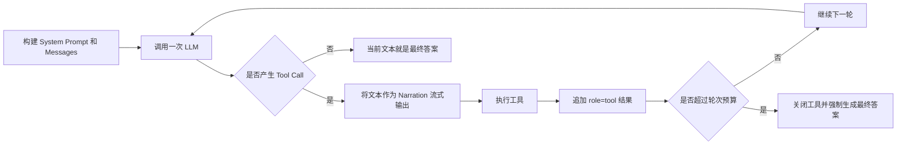
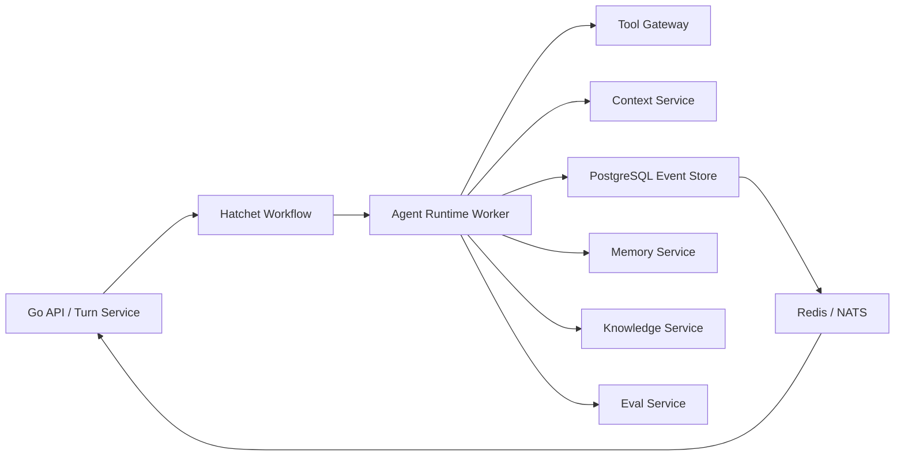

# 结论

截至仓库 `main` 分支当前版本（README 标注 v1.5.2，2026 年 7 月 19 日），DeepTutor 的技术架构可以定义为：

> **一个 Local-first、模块化单体形态的 Agent Runtime 平台。它通过统一 Turn Runtime，把聊天、解题、出题、研究、可视化、掌握学习、外部 Agent、RAG、技能和记忆系统连接到同一条执行链路中。**

它并不是典型的：

* LangGraph 式显式状态图；
* 多个 Agent 服务互相调用的微服务架构；
* 每个业务功能各自维护一套 Agent Loop。

其核心设计是：

> **一个统一上下文 `UnifiedContext`，一个统一入口 `ChatOrchestrator`，两级扩展模型 `Tools + Capabilities`，一套统一流式事件协议。**

---

# 一、整体架构图

```mermaid
flowchart TD
    U[用户 / Browser / CLI / Python SDK]

    subgraph Frontend[表现层]
        NX[Next.js 16 + React 19]
        WSC[Unified WebSocket Client]
    end

    subgraph API[接入层]
        PX[Next.js Proxy]
        FA[FastAPI REST API]
        WS[/api/v1/ws]
    end

    subgraph Runtime[Turn Runtime]
        TRM[TurnRuntimeManager]
        CB[ContextBuilder / Context Assembly]
        UC[UnifiedContext]
        ORCH[ChatOrchestrator]
        SB[StreamBus]
    end

    subgraph Capability[能力编排层]
        CR[CapabilityRegistry]
        CHAT[Chat Capability]
        SOLVE[Deep Solve]
        RESEARCH[Deep Research]
        QUESTION[Deep Question]
        VIS[Visualize / Math Animator]
        MASTERY[Mastery Path]
    end

    subgraph AgentLoop[Agent 执行层]
        PIPE[AgenticChatPipeline]
        LOOP[Single Agent Loop]
        LLM[LLM Provider Adapter]
        TD[Tool Dispatch]
    end

    subgraph Tools[工具与扩展层]
        TOOLREG[ToolRegistry]
        RAG[RAG / Read Source]
        MCP[MCP / Deferred Tools]
        MEM[Memory Tools]
        SKILL[Skills / Persona]
        EXEC[Sandbox / Code Execution]
        SUB[Claude Code / Codex / Partners]
        WEB[Web / Paper / GitHub]
    end

    subgraph Data[状态与数据层]
        SQL[SQLite Session Store]
        PB[PocketBase Optional]
        FILE[data/ 文件工作区]
        KB[Versioned Knowledge Bases]
        MEMORY[L1 / L2 / L3 Memory]
        ART[Attachments / Artifacts]
    end

    U --> NX
    U --> FA
    U --> ORCH

    NX --> WSC
    NX --> PX
    PX --> FA
    WSC --> WS
    WS --> TRM

    TRM --> CB
    CB --> UC
    UC --> ORCH

    ORCH --> CR
    CR --> CHAT
    CR --> SOLVE
    CR --> RESEARCH
    CR --> QUESTION
    CR --> VIS
    CR --> MASTERY

    CHAT --> PIPE
    PIPE --> LOOP
    LOOP --> LLM
    LOOP --> TD
    TD --> TOOLREG

    TOOLREG --> RAG
    TOOLREG --> MCP
    TOOLREG --> MEM
    TOOLREG --> SKILL
    TOOLREG --> EXEC
    TOOLREG --> SUB
    TOOLREG --> WEB

    ORCH --> SB
    SB --> TRM
    TRM --> WSC

    TRM --> SQL
    TRM --> PB
    CB --> FILE
    RAG --> KB
    MEM --> MEMORY
    EXEC --> ART
```

---

# 二、架构定位：它本质上是什么

| 维度       | DeepTutor 的实现                        |
| -------- | ------------------------------------ |
| 系统形态     | Local-first 模块化单体                    |
| 后端       | Python 3.11、FastAPI、AsyncIO、Pydantic |
| 前端       | Next.js 16、React 19、TypeScript       |
| 通信       | REST + 单一 WebSocket Endpoint         |
| Agent 编排 | Capability 路由 + 单 Agent Loop         |
| 工具调用     | OpenAI-compatible Function Calling   |
| 扩展机制     | Tool、Capability、MCP、SKILL.md、Partner |
| 会话状态     | SQLite 默认，PocketBase 可选              |
| 知识系统     | 每个 KB 绑定一个 RAG Engine                |
| 记忆系统     | 文件型 L1/L2/L3 可审计记忆                   |
| 部署形态     | 本地进程、PyPI、Docker 单容器、CLI-only        |
| 多用户      | 同一 `data/` 树下的 Workspace 隔离          |

后端依赖中包含 FastAPI、WebSocket、SQLite、PocketBase、LlamaIndex、FAISS，以及多种模型 Provider SDK；前端使用 Next.js 16、React 19、Cytoscape、Mermaid、Chart.js 等。

---

# 三、核心设计一：统一 Turn Runtime

DeepTutor 最重要的架构概念不是 Session，而是：

> **Session 是长期会话，Turn 是一次可执行、可暂停、可恢复、可取消、可重放的 Agent 任务。**

前端通过统一 WebSocket `/api/v1/ws` 发送：

* `start_turn`
* `subscribe_turn`
* `resume_from`
* `cancel_turn`
* `regenerate`
* `submit_user_reply`

每个 Turn 都有：

* `turn_id`
* 单调递增的 `seq`
* 执行状态
* 流式事件
* 持久化事件
* 实时订阅者
* 暂停后等待用户输入的队列

前端 WebSocket Client 会维护：

* 30 秒心跳；

* 45 秒无响应检测；

* 指数退避重连；

* 当前 `turn_id`；

* 已接收的最后一个 `seq`；

* 重连后的 `resume_from`。

## 这一层解决的问题

传统 SSE 或普通 WebSocket 的典型问题是：

* 浏览器刷新后结果丢失；
* 网络断开后不知道从哪里继续；
* 后端已经完成但前端仍显示“生成中”；
* 用户无法中止；
* Agent 请求澄清时只能结束当前任务，再开一轮。

DeepTutor 给每个流式事件编号，并同时保存在 Turn Runtime 和 Session Store 中。重新订阅时，先读取持久化事件，再接入实时队列。

这是一种：

> **Event-sourced-like 的 Turn Streaming Runtime。**

它不是真正完整的事件溯源系统，但已经采用了“事件序列是运行过程的主要事实记录”的思路。

---

# 四、核心设计二：Context Assembly 与 UnifiedContext

执行 Agent 之前，`TurnRuntimeManager` 会先拼装完整运行上下文。

主要包括：

* 当前用户消息；
* 历史对话和压缩摘要；
* 附件及其抽取文本；
* Knowledge Base；
* Notebook；
* Question Bank；
* Book；
* Persona；
* Skills Manifest；
* Memory；
* 当前模型和 Provider；
* 多用户权限；
* 工具白名单；
* 当前 Turn 的恢复函数。

最终所有数据进入同一个 `UnifiedContext`：

```python
UnifiedContext(
    session_id=...,
    user_message=...,
    conversation_history=...,
    enabled_tools=...,
    active_capability=...,
    knowledge_bases=...,
    attachments=...,
    config_overrides=...,
    memory_context=...,
    persona_context=...,
    skills_manifest=...,
    source_manifest=...,
    metadata=...,
)
```

实际构建上下文时，它还会完成：

* 上传并持久化附件原始字节；

* 解析 PDF、DOCX、XLSX、PPTX；

* 构建来源清单；

* 从 L3 Memory 读取用户画像；

* 解析当前用户可见的 Skills；

* 解析管理员分配的模型、知识库和工具；

* 注入 `wait_for_user_reply`，支持 Agent 暂停等待用户回复。

## 这个设计的本质

它把 Agent 的执行输入从一段 Prompt，提升成了一个显式运行契约：

> `UnifiedContext = 用户意图 + 会话状态 + 权限 + 知识 + 记忆 + 技能 + 附件 + 运行参数`

这是 DeepTutor 架构中最值得借鉴的部分之一。

---

# 五、核心设计三：ChatOrchestrator 只是路由器

`ChatOrchestrator` 本身非常薄。

它只负责：

1. 确保存在 `session_id`；
2. 根据 `active_capability` 选择 Capability；
3. 默认选择 `chat`；
4. 创建 `StreamBus`；
5. 启动 Capability；
6. 转发流式事件；
7. 发送 `DONE`；
8. 发布完成事件。

因此它不是复杂的规划器，也不是 Workflow Engine。

它更接近：

> **Agent Runtime Dispatcher / Capability Router**

其路由模型是：

```text
UnifiedContext
      ↓
ChatOrchestrator
      ↓
CapabilityRegistry.get(active_capability)
      ↓
capability.run(context, stream)
```

---

# 六、核心设计四：Tools 和 Capabilities 两级扩展模型

DeepTutor 把扩展能力分成两层。

## Level 1：Tool

Tool 是 LLM 在 Agent Loop 中按需调用的单一能力。

例如：

* `rag`
* `web_search`
* `paper_search`
* `read_memory`
* `write_memory`
* `read_skill`
* `read_source`
* `exec`
* `code_execution`
* `github`
* `consult_subagent`
* `ask_user`
* `load_tools`

Tool Registry 负责：

* 注册和注销；

* 名称别名；

* Tool Schema；

* OpenAI Function Calling Schema；

* Prompt Hint；

* 实际执行。

Tool 不是全部直接暴露给模型，而是按照上下文动态挂载：

```text
有 KB             → 挂载 rag
有 Memory         → 挂载 read_memory / write_memory
有 Skills         → 挂载 read_skill
有 Sandbox        → 挂载 exec / code_execution
有 MCP Server     → 挂载 deferred tools
选择了 Subagent   → 挂载 consult_subagent
```

这叫做：

> **Context-gated Tool Mounting**

它能避免把几十个工具 Schema 一次性塞给模型。

---

## Level 2：Capability

Capability 是一个能够接管整个 Turn 的多阶段流程。

当前内置能力包括：

| Capability      | 主要阶段                                               |
| --------------- | -------------------------------------------------- |
| `chat`          | Agent Loop                                         |
| `deep_solve`    | planning → reasoning → writing                     |
| `deep_question` | ideation → generation                              |
| `deep_research` | rephrasing → decomposing → researching → reporting |
| `visualize`     | analyzing → generating → reviewing                 |
| `math_animator` | concept analysis → design → code → retry → render  |
| `mastery_path`  | Chat Loop + Mastery Tools                          |

这些 Capability 使用字符串类路径动态加载：

```python
"chat": "deeptutor.agents.chat.capability:ChatCapability"
"deep_solve": "deeptutor.capabilities.solve.capability:DeepSolveCapability"
"deep_research": "deeptutor.agents.research.capability:DeepResearchCapability"
```

## Tool 和 Capability 的关键区别

```text
Tool：
LLM 决定什么时候调用
一次调用完成一个动作

Capability：
系统在 Turn 开始前选择
它拥有整个 Turn 的生命周期和阶段
```

因此 Capability 更像：

> **目标模式 + Prompt Policy + Tool Policy + Workflow Pipeline**

而不是一个独立的 Agent 实例。

---

# 七、核心设计五：当前 Chat 实际是一个合并后的单 Agent Loop

这是理解当前代码时最容易混淆的地方。

文档和 Capability Manifest 中仍然把 Chat 描述为：

```text
exploring → responding
```

但当前 `AgentLoop` 的代码已经明确说明：

> 不再有单独的 Explore Pass 和 Respond Pass，而是在同一个不断增长的 Conversation 中循环执行。

实际流程是：



当前的终止逻辑是：

* 本轮调用了工具：继续循环；

* 本轮没有调用工具：本轮文本就是最终答案；

* 达到最大轮数仍在调用工具：关闭工具，强制 Finish；

* `ask_user`：暂停 Turn；

* 用户回复后，把回复写入对应 `role=tool` 消息；

* 从原有 Agent Loop 继续运行。

这实际上属于一种：

> **Streaming ReAct / Function-Calling Loop**

而不是 Plan → Execute → Reflect 的显式状态机。

---

# 八、`ask_user` 不是普通工具，而是 Runtime 控制指令

普通 Tool 调用后，会返回 Tool Result。

`ask_user` 则会产生一个 Pause：

```text
Agent 调用 ask_user
        ↓
TurnRuntime 保持 Running
        ↓
前端显示结构化问题
        ↓
用户提交 submit_user_reply
        ↓
回复进入 Turn 对应的 Queue
        ↓
替换为 role=tool 消息
        ↓
Agent Loop 从原位置继续
```

这让 Human-in-the-loop 不是一个新会话，而是同一个 Turn 的一个中间状态。

这项设计很适合教育 Agent，因为它可以支持：

* 澄清题意；
* 让学生补充思路；
* 要求学生先作答；
* 分步提示；
* 苏格拉底式追问；
* 人工审批工具执行。

---

# 九、RAG 架构：每个知识库绑定一个检索引擎

DeepTutor 没有把 RAG 固定为一个 Vector Store。

每个 Knowledge Base 创建时绑定一个 Provider：

| Provider        | 架构                       |
| --------------- | ------------------------ |
| LlamaIndex      | 本地 Vector + BM25 Hybrid  |
| PageIndex       | 托管式、无向量、基于文档推理和 MCP Tool |
| GraphRAG        | 本地知识图谱检索                 |
| LightRAG        | Graph + Vector，多模态解析     |
| LightRAG Server | 外部独立服务，通过 HTTP 查询        |

工厂模式负责根据 Provider 创建 Pipeline：

```python
get_pipeline(provider, kb_base_dir)
```

并按照：

```text
(kb_base_dir, provider)
```

缓存实例。

## 值得注意的架构细节

不同 RAG Engine 并没有完全统一成同一种语义：

* LlamaIndex 通过 `rag` Tool；
* PageIndex 通过预加载 MCP Tools；
* GraphRAG 和 LightRAG 有各自查询模式；
* LightRAG Server 不负责本地索引。

所以这是：

> **统一生命周期接口，但没有完全统一检索执行语义。**

这会导致部分 Provider 特殊逻辑渗透到 Chat Pipeline。例如 PageIndex 需要在 Chat Pipeline 内单独识别并挂载 MCP Tools。

---

# 十、Memory 架构：文件型、可审计的三层记忆

DeepTutor 的 Memory 不是把历史对话直接写进向量数据库。

其设计是：

```text
L1：原始事件 Trace
    trace/<surface>/<date>.jsonl

        ↓ Consolidation

L2：各业务 Surface 的事实
    L2/chat.md
    L2/notebook.md
    L2/quiz.md
    L2/book.md
    ...

        ↓ Cross-surface Synthesis

L3：用户级综合画像
    L3/profile.md
    L3/preferences.md
    L3/recent.md
    L3/scope.md
```

Consolidator 提供：

* `update`：从下层增量提取事实；
* `audit`：用原始证据审计已有记忆；
* `dedup`：跨条目去重；
* `merge`：合并记忆。

而且 L2/L3 内容带有来源引用，可以从 L3 回溯到 L2，再回溯到 L1 原始事件。

## 这套设计的优势

它解决了教育个性化中的一个关键问题：

> “系统为什么认为这个学生不擅长某个知识点？”

答案不是“向量召回到了某段历史”，而是可以沿引用链找到具体交互证据。

这是比普通聊天应用的 Memory 更接近：

* Learner Model；
* Evidence-backed Profile；
* 可治理用户画像；
* 可编辑长期记忆。

---

# 十一、Partners 和 Subagents 的真实定位

## Partner

Partner 并不是另一个 Agent Engine。

每一条 Partner 消息最终仍然进入：

```text
ChatOrchestrator
    → AgenticChatPipeline
```

区别只在于：

* 有独立 `SOUL.md`；
* 独立 Workspace；
* 独立 Memory；
* 独立 Skills；
* 独立 Knowledge Base；
* 独立工具策略；
* 接入飞书、Telegram、Slack 等 IM Channel。

可以理解为：

> **Partner = Synthetic User Workspace + Persona + Channel Adapter**

---

## Subagent

Claude Code、Codex 或另一个 Partner 被包装成 `consult_subagent` Tool。

因此主 Agent 调用 Subagent 的方式是：

```text
主 Agent
   ↓ consult_subagent
外部 Agent Runtime
   ↓ 输出
Tool Result
   ↓
主 Agent 继续推理并生成最终答案
```

这不是对等多 Agent 协商，更接近：

> **Supervisor Agent 调用外部 Worker Agent。**

---

# 十二、前后端与部署架构

## 前端

前端是 Next.js 16。

浏览器只访问前端 Origin。Next.js Proxy 将：

```text
/api/*
/ws/*
```

转发给 FastAPI 后端。

这使 Docker 单容器只需要暴露前端 `3782` 端口，FastAPI `8001` 可以只在容器内部访问。

---

## 后端

FastAPI 启动时会初始化：

* Tool/Capability 一致性检查；
* LLM Client；
* 全局 EventBus；
* Partners；
* Cron；
* PocketBase；
* Memory Migration；
* REST Routers；
* WebSocket Router。

API Router 覆盖：

* Chat

* Knowledge

* Book

* Co-Writer

* Memory

* Skills

* Subagents

* Partners

* Sessions

* Tools

* Settings

* Multi-user

---

## 数据持久化

默认 Session Store 是 SQLite；配置 PocketBase 后，可以切换为 PocketBase Session Store。

其他数据大量保存在文件系统：

```text
data/
├── user/
│   ├── settings/
│   ├── memory/
│   ├── knowledge/
│   ├── skills/
│   └── workspace/
├── users/<uid>/
├── partners/<partner-id>/workspace/
└── system/
```

多用户模式下，每个用户和 Partner 使用独立 Workspace。

---

# 十三、一次 Chat Turn 的完整执行链

```text
1. 用户在 Next.js 页面提交消息
2. UnifiedWSClient 发送 start_turn
3. FastAPI /api/v1/ws 接收请求
4. TurnRuntimeManager 创建 Turn
5. 验证 Capability Config 和用户权限
6. 创建或读取 Session
7. 解析附件、历史、Book、Notebook、Question Bank
8. 读取 Memory、Persona、Skills
9. 构建 UnifiedContext
10. ChatOrchestrator 选择 Capability
11. ChatCapability 创建 AgenticChatPipeline
12. Pipeline 根据上下文挂载 Tools
13. AgentLoop 调用 LLM
14. 如果产生 Tool Call，执行并把结果写回 Conversation
15. 如果调用 ask_user，暂停并等待用户
16. 如果没有 Tool Call，当前文本成为最终回答
17. StreamBus 生成 Content、Thinking、ToolCall、Sources、Result 等事件
18. TurnRuntimeManager 给事件分配 seq
19. 同时发送给 WebSocket 和持久化 Store
20. 保存 Assistant Message、Trace 和生成文件
21. Turn 状态更新为 completed
22. 前端收到 DONE
```

其中从 `UnifiedContext` 到 `ChatOrchestrator`，再到事件保存的核心代码路径非常清晰。

---

# 十四、架构优势

## 1. 所有功能共享同一运行时

Chat、Research、Solve、Quiz、Mastery 不需要分别实现：

* 会话；
* 流式输出；
* 工具调用；
* 权限；
* 记忆；
* 附件；
* 成本统计；
* 错误恢复。

这显著降低了能力之间的实现漂移。

## 2. Tool 与 Capability 的边界比较合理

它避免了两个极端：

* 所有事情都做成 Tool，导致复杂工作流完全依赖模型临场发挥；
* 所有事情都写死成 Pipeline，导致 Agent 丧失自主工具选择能力。

## 3. Turn 是一等运行对象

`session_id + turn_id + seq` 的设计，比简单的 SSE Chat Completion 更适合：

* 长任务；
* Agentic Research；
* Human-in-the-loop；
* 中止与恢复；
* UI Trace；
* 多端接入。

## 4. Memory 可审计

L1 → L2 → L3 的证据链非常适合教育、医疗、企业知识等需要可解释个性化的场景。

## 5. Local-first 的产品工程完整度高

模型、文件、知识库、记忆、技能和配置可以全部保存在本地 Workspace，部署成本较低。

---

# 十五、当前架构的主要问题

## 1. `TurnRuntimeManager` 已经接近 God Object

它同时负责：

* Session；
* Turn；
* 权限；
* 模型选择；
* Context Assembly；
* 附件；
* Memory；
* Skills；
* Persona；
* Branching；
* Event Persistence；
* WebSocket Resume；
* Ask-user Queue；
* Assistant Message Persistence。

这些责任本应拆分为：

```text
TurnService
ExecutionManager
ContextAssembler
EventStore
ArtifactService
SessionService
HumanInputBroker
```

当前实现功能完整，但后续维护成本会持续上升。

---

## 2. 当前 Turn Execution 是进程内状态

核心执行状态保存在：

```python
self._executions
self._reply_queues
```

也就是当前 Python 进程内存。

服务器重启后：

* Persisted Turn 可能还显示 `running`；
* 实际 Task 和 Queue 已丢失；
* Runtime 会把这种 Turn 标记为 failed。

所以它的“恢复”主要是：

> WebSocket 断线后的事件恢复，而不是跨进程、跨服务器的 Agent Execution 恢复。

这意味着当前架构并不适合直接水平扩容多个 Backend Replica。

---

## 3. 模块化单体内部存在较多隐式依赖

代码中大量采用：

* 全局 Singleton；
* Lazy Import；
* ContextVar；
* 文件路径上下文；
* 当前用户上下文；
* 当前模型上下文；
* 运行时动态 Registry。

优点是开发速度快，缺点是：

* 依赖关系不够显式；
* 并发隔离更难验证；
* 单元测试需要重置大量全局状态；
* 多租户和异步任务容易出现上下文泄漏。

---

## 4. RAG Provider 抽象存在泄漏

虽然有统一 `get_pipeline()`，但 PageIndex、LlamaIndex、GraphRAG、LightRAG 的执行方式差异很大。

PageIndex 已经需要在 AgenticChatPipeline 内专门处理，这说明 Provider 抽象并没有完全屏蔽底层差异。

更理想的抽象应该是：

```text
KnowledgeRetriever
├── index()
├── retrieve()
├── read_document()
├── list_sources()
├── health()
└── capabilities()
```

然后由 Capability Metadata 描述是否支持：

* Chunk Retrieval；
* Page Reasoning；
* Graph Query；
* Citation；
* Multimodal；
* Incremental Index。

---

## 5. Capability Plugin 缺少严格生命周期和兼容契约

当前 Capability 主要通过：

```text
字符串类路径 + 动态 import + manifest
```

加载。

适合单仓库扩展，但如果要发展成真正的插件平台，还缺少：

* API Version；
* Runtime Compatibility；
* Dependency Isolation；
* Permission Declaration；
* Resource Limits；
* Migration；
* Health Check；
* Plugin Sandbox。

---

# 十六、对你当前 Agent Runtime 架构的参考价值

结合你现在的 **Go + Hatchet + TypeScript Agent Runtime** 方向，DeepTutor 最值得借鉴的是以下五点。

## 建议直接借鉴

### 1. `UnifiedContext`

不要让每个 Agent 直接读取各种全局服务。

统一定义：

```go
type TurnContext struct {
    Tenant          TenantContext
    User            UserContext
    Session         SessionContext
    Message         UserMessage
    History         ConversationContext
    Knowledge       KnowledgeContext
    Memory          MemoryContext
    Skills          []SkillManifest
    Attachments     []Attachment
    Capability      CapabilitySelection
    ToolPolicy      ToolPolicy
    ModelSelection  ModelSelection
    RuntimeMetadata map[string]any
}
```

### 2. Tool 与 Capability 分层

```text
Tool = 原子动作
Capability = 目标导向的执行策略
Workflow = Capability 的可靠运行载体
```

不要把 Capability 和 Agent Instance 混为一谈。

### 3. 统一 StreamEvent 协议

至少保留：

```text
stage_start
stage_end
thinking
content
tool_call
tool_result
progress
sources
result
error
done
```

这样前端、CLI、日志和 Eval 可以使用同一协议。

### 4. Context-gated Tool Mounting

不要把所有工具都暴露给模型。

工具可见性应由：

```text
用户权限
Capability
任务上下文
数据资源
Sandbox
模型能力
成本策略
```

共同决定。

### 5. L1/L2/L3 证据型 Memory

对于 K12 教育，应进一步演进为：

```text
L1：原始学习行为
L2：知识点级事实与错误模式
L3：长期学习画像与教学策略
Ontology：知识点、题型、能力、误区、教学干预之间的关系
```

---

## 不建议直接照搬

不要把执行状态保存在单个 Agent Runtime 进程的 `_executions` 中。

你的目标架构更适合：



对应关系如下：

| DeepTutor            | 你的推荐实现                          |
| -------------------- | ------------------------------- |
| `TurnRuntimeManager` | Hatchet Workflow + Turn Service |
| `_executions`        | Workflow Execution              |
| `_reply_queues`      | Durable Signal / Workflow Event |
| `StreamBus`          | Event Store + Redis/NATS        |
| `UnifiedContext`     | ContextAssembler 输出契约           |
| `CapabilityRegistry` | Capability Definition Registry  |
| `ToolRegistry`       | Tool Gateway / MCP Registry     |
| SQLite Events        | PostgreSQL Turn/Event Tables    |
| 文件型多用户隔离             | Tenant-aware Storage Adapter    |
| 进程内恢复                | Durable Workflow Recovery       |

---

# 最终判断

DeepTutor 的核心创新不在于“用了多少 Agent”，而在于：

> **它把教育应用中的各个 AI 功能，统一成了一个可流式执行、可挂载工具、可注入知识和记忆、可暂停恢复的 Turn Runtime。**

从架构角度，它可以被概括为四层：

```text
第一层：Learning Surfaces
Chat / Book / Co-Writer / Partner / Mastery

第二层：Capability Runtime
Chat / Solve / Research / Question / Visualize

第三层：Agent Loop + Tools
LLM Function Calling / MCP / RAG / Skills / Subagents

第四层：Personalization Substrate
Session / Knowledge / Memory / Persona / User Workspace
```

它非常适合：

* 单机或单实例部署；
* 个人知识与学习工作台；
* Agent 产品原型；
* 需要强交互和流式 Trace 的应用。

但如果要进入几十万 DAU 的 K12 生产系统，应保留其：

* `UnifiedContext`
* Tool/Capability 分层
* StreamEvent
* Evidence-backed Memory
* Context-gated Tools

同时把：

* Turn Execution；
* Human Input；
* Event Persistence；
* Context Assembly；
* 多租户隔离；

从进程内模块升级为独立、可持久恢复的 Runtime 基础设施。
