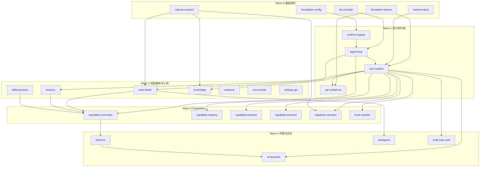

# DeepTutor Go 重写 — 模块划分与实施路线

> 本文档定义 openspec 模块（capability）的划分、依赖关系与实施顺序。每个模块对应 `specs/<module>/spec.md`，可独立立项实现（openspec change），完成定义见 `docs/golang-req/acceptance.md`。

## 1. 划分原则

1. **按依赖分波**：下层契约（协议/存储/LLM/Sidecar）先冻结，上层业务并行推进。
2. **按可独立验收切块**：每个模块有自己的协议对等面（REST/WS 子集）或独立测试面，可单独交付。
3. **Python 生态绑定不入 Go**：RAG、文档解析、Manim、Python 沙箱固化为 `sidecar-contract` 一个模块的契约，Go 侧只依赖契约。
4. **规模控制**：单模块对应基线代码 1k–10k 行，实现周期可控；超大域（tools、partners）在 spec 内部再分批次。

## 2. 模块总览（26 个）

### Wave 0 — 基础契约（无相互依赖，可并行）

| 模块 | Spec | 基线参考 | 内容 |
| --- | --- | --- | --- |
| foundation-config | `specs/foundation-config/` | `services/config/runtime_settings.py`、`services/path_service.py` | settings JSON 读写、process-env override、`data/` 路径服务 |
| foundation-stream | `specs/foundation-stream/` | `core/stream.py`、`core/stream_bus.py` | StreamEvent 协议、StreamBus 扇出、seq 语义 |
| session-store | `specs/session-store/` | `services/session/sqlite_store.py`、`protocol.py`、`api/routers/sessions.py` | SQLite schema 兼容、store API、sessions REST |
| llm-provider | `specs/llm-provider/` | `services/llm/`、`services/provider_registry.py`、`core/agentic/client.py` | provider 注册表、OpenAI-compat/Anthropic 流式、tool_call 归一、mock provider |
| sidecar-contract | `specs/sidecar-contract/` | `services/rag/service.py`、`services/parsing/`、`services/sandbox/`、`agents/math_animator/renderer.py` | Sidecar typed API（RAG/Parse/Manim/Exec）+ Python 侧剥离 |

### Wave 1 — 运行时内核（依赖 Wave 0）

| 模块 | Spec | 基线参考 | 内容 |
| --- | --- | --- | --- |
| runtime-registry | `specs/runtime-registry/` | `runtime/orchestrator.py`、`runtime/registry/` | ToolRegistry / CapabilityRegistry / Orchestrator 路由 |
| agent-loop | `specs/agent-loop/` | `agents/chat/agentic_pipeline.py`、`core/agentic/` | Agent Loop、context-gated tool mounting、轮次预算、narration 流式 |
| turn-runtime | `specs/turn-runtime/` | `services/session/turn_runtime.py`、`context_builder.py` | Turn 生命周期/状态机、seq 分配、事件持久化、resume/cancel/regenerate、ask_user 队列、UnifiedContext 组装 |
| api-unified-ws | `specs/api-unified-ws/` | `api/routers/unified_ws.py` | `/api/v1/ws` 11 种消息类型、心跳、错误语义 |

### Wave 2 — 领域服务与工具（依赖 Wave 1，模块间可并行）

| 模块 | Spec | 基线参考 | 内容 |
| --- | --- | --- | --- |
| tools-builtin | `specs/tools-builtin/` | `tools/`、`tools/builtin/__init__.py` | 全部内置工具（分三批：LLM/HTTP 类 → 本地状态类 → Sidecar 类） |
| memory | `specs/memory/` | `services/memory/`、`api/routers/memory.py` | L1/L2/L3 文件存储、consolidator、memory REST、read/write_memory tools |
| skills-persona | `specs/skills-persona/` | `services/skill*`、`skills/builtin/`、`api/routers/skills.py`、`personas.py` | SKILL.md 解析、skills manifest、read_skill/load_tools、persona |
| knowledge | `specs/knowledge/` | `knowledge/`、`api/routers/knowledge.py` | KB CRUD/版本/文件管理（Go），索引/检索转发 Sidecar，progress WS |
| notebook | `specs/notebook/` | `api/routers/notebook.py`、`question_notebook.py` | notebook/question-notebook REST + list_notebook/write_note tools |
| cron-events | `specs/cron-events/` | `services/cron/`、`events/event_bus.py` | cron 持久化调度 + 全局 EventBus + cron tool |
| settings-api | `specs/settings-api/` | `api/routers/settings.py`、`system.py`、`tools.py`、`agent_config.py`、`mcp_settings.py` | Settings/System/Tools 配置 REST 面 |

### Wave 3 — Capabilities（依赖 Wave 1/2）

| 模块 | Spec | 基线参考 | 内容 |
| --- | --- | --- | --- |
| capability-chat-solve | `specs/capability-chat-solve/` | `agents/chat/`、`capabilities/solve/` | chat（M1 先行）+ deep_solve（planning/reasoning/writing + solve tools） |
| capability-mastery | `specs/capability-mastery/` | `capabilities/mastery/`、`learning/`、`api/routers/mastery_path.py` | mastery_path + learning 引擎（grading/mastery/scheduler）+ REST |
| capability-question | `specs/capability-question/` | `agents/question/`、`api/routers/question.py`、`quiz_judge.py` | deep_question（ideation→generation）+ 出题/仿题/判题 WS |
| capability-research | `specs/capability-research/` | `agents/research/` | deep_research 四阶段流水线 |
| capability-visualize | `specs/capability-visualize/` | `agents/visualize/`、`agents/math_animator/` | visualize（SVG/Chart.js/Mermaid/HTML）+ math_animator（渲染经 Sidecar） |
| book-cowriter | `specs/book-cowriter/` | `book/`、`co_writer/`、`api/routers/book.py`、`co_writer.py` | BookEngine + book WS + Co-Writer REST |

### Wave 4 — 外围与交付（依赖 Wave 1–3）

| 模块 | Spec | 基线参考 | 内容 |
| --- | --- | --- | --- |
| partners | `specs/partners/` | `partners/channels/`、`services/partners/`、`api/routers/partners.py` | partner runtime/workspace/SOUL.md + channels（首批 feishu/telegram/slack/discord）+ partner WS/REST |
| subagents | `specs/subagents/` | `services/subagent/`、`capabilities/subagent/`、`api/routers/subagents.py` | consult_subagent（Claude Code/Codex 子进程流式）+ REST |
| multi-user-auth | `specs/multi-user-auth/` | `multi_user/`、`api/routers/auth.py` | 鉴权、workspace 隔离、管理员资源分配 |
| cli-launcher | `specs/cli-launcher/` | `deeptutor_cli/`、`runtime/launcher.py` | CLI（run/chat/kb/memory/serve/start）+ launcher + 打包 |

## 3. 依赖关系

## 4. 实施顺序与里程碑映射

| 里程碑 | 模块（按启动顺序） | 说明 |
| --- | --- | --- |
| M0 | foundation-config、foundation-stream、session-store、llm-provider（契约+mock）、sidecar-contract | 同时产出验收工具链：OpenAPI golden spec、WS fixtures 录制/回放器 |
| M1 | runtime-registry、agent-loop、turn-runtime、api-unified-ws、llm-provider（实现）、tools-builtin（第一批）、capability-chat-solve（chat 部分） | 退出条件：前端 Chat 页全功能可用 |
| M2 | memory、skills-persona、knowledge、notebook、cron-events、settings-api、tools-builtin（第二/三批） | 模块间可并行，多人可按 spec 分工 |
| M3 | capability-chat-solve（solve 部分）、capability-mastery、capability-question、capability-research、capability-visualize、book-cowriter | 各 capability 相互独立，可并行 |
| M4 | partners、subagents、multi-user-auth | channel 按 feishu→telegram→slack→discord 顺序 |
| M5 | cli-launcher + 全量回归 + 切换演练 | 见 acceptance.md 第 4 节 M5 矩阵 |

## 5. 独立实施工作流

每个模块按以下流程独立推进：

1. **立项**：从 `specs/<module>/spec.md` 建 openspec change：`changes/impl-<module>/`（`proposal.md`：Why/What Changes/Impact；`tasks.md`：实现清单；必要时 `design.md`）。
2. **实现**：按 spec Requirement 逐条实现；每个 Scenario 落为测试。
3. **验收**：spec Scenario 全过 + 该模块协议对等测试（golden spec / fixtures 子集）全过；与基线的有意差异登记到 acceptance.md 第 6 节。
4. **归档**：change archive，spec 保持为该模块的最新事实。

并行约束：

- 同一 Wave 内模块可并行；跨 Wave 依赖以第 3 节依赖图为准（允许对下游模块先行 stub，但合入需依赖模块已验收）。
- `contracts/` 下的冻结契约（OpenAPI、WS fixtures、sidecar contract）变更需评审，并同步更新受影响 spec。
